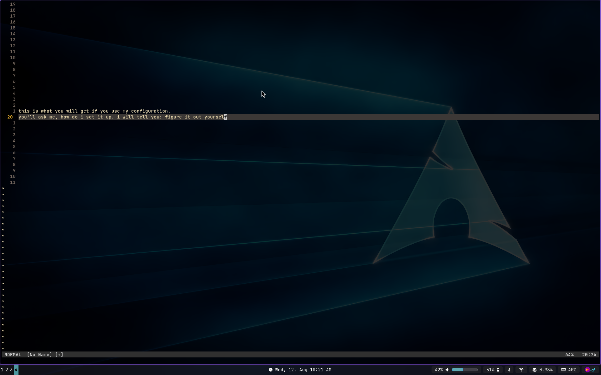
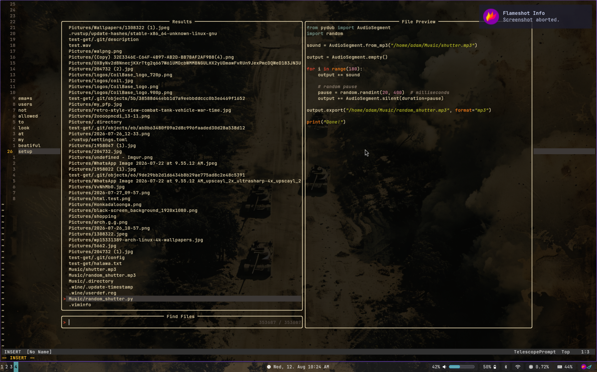
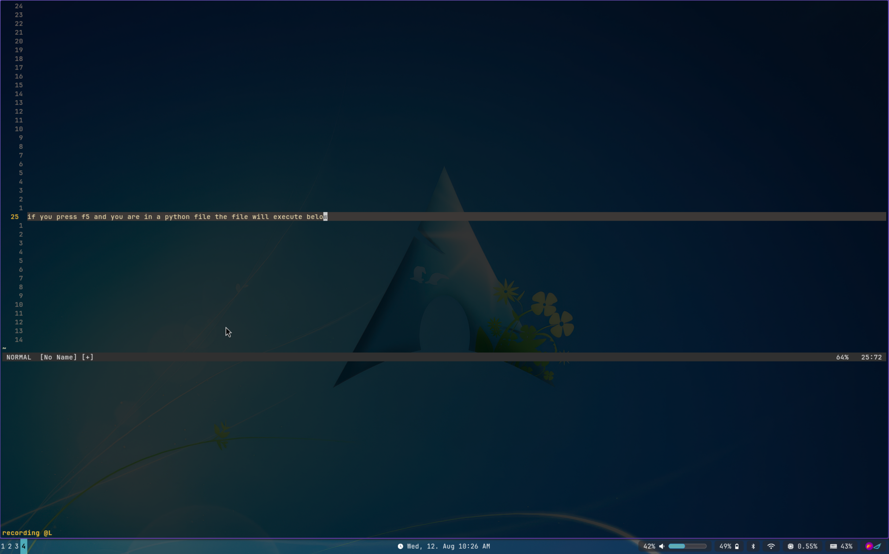

# My Neovim Configuration

By Dodoprospy3

---





---

## What is this?

My personal Neovim configuration.

It works on my machine.

That is all the quality assurance you are getting.

---

## Installation

Clone this repository into:

```bash
~/.config/nvim
```

Then open Neovim.

If it works, congratulations.

If it doesn't, congratlations, you now have something to do.

---

## Requirements
- Neovim
- Git
- A terminal
- Basic reading comprehension
- The ability to solve problems without being escorted by a tutorial
- Unreasonable levels of patience

---

## Documentation

There is none.

Figure it out yourself.

You have the source code. You have the internet. You have a functioning computer. What more do you want, a personal assistant?

Read the Lua files.

Read the plugin documentation.

Look at the keymaps.

Run `:checkhealth`.

Run `:messages`.

Press buttons until something happens.

If something breaks, congratulations. You have discovered how software works.

If you find a keybind you don't understand, investigate it.

If you find a plugin you don't recognize, look it up.

If you find a mysterious piece of Lua that apears to have been written by a sleep-deprived wizard at 3 AM, it probably was.

I am not writing 400 lines explaining what lua/config/keymaps.lua does.

You have eyes.

Use them.

---

## Support

There is no support.

There is only `:help`.

Good luck. You're going to need it.
